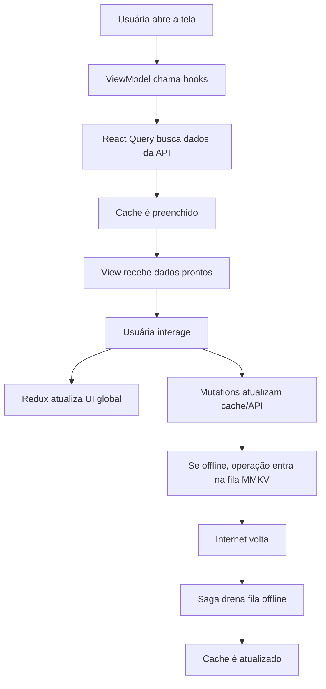

# Guia do Projeto

Este documento foi escrito para te ajudar a **entender o projeto de verdade** e conseguir **apresentá-lo com segurança**, mesmo sem já dominar todas as tecnologias usadas nele.

A ideia aqui não é só listar arquivos. É te explicar:

- o que o app faz
- como os dados circulam
- por que certas bibliotecas foram escolhidas
- o que cada hook faz
- como cada hook afeta a tela
- como Redux, React Query, Saga, MMKV, Storybook, Maestro e deep linking entram na história

Se você ler este guia com calma, vai conseguir explicar o projeto como alguém que realmente entendeu a solução.

---

## Sumário

1. [Visão geral do projeto](#visão-geral-do-projeto)
2. [Arquitetura geral](#arquitetura-geral)
3. [Tecnologias do projeto](#tecnologias-do-projeto)
4. [Fluxo real do app de ponta a ponta](#fluxo-real-do-app-de-ponta-a-ponta)
5. [Hooks do projeto em detalhe](#hooks-do-projeto-em-detalhe)
6. [Explicação de cada tela](#explicação-de-cada-tela)
7. [Services, storage e store](#services-storage-e-store)
8. [Utils](#utils)
9. [Componentes mais importantes](#componentes-mais-importantes)
10. [Testes em visão geral](#testes-em-visão-geral)
11. [Storybook, deep linking e Maestro](#storybook-deep-linking-e-maestro)
12. [Roteiro de apresentação](#roteiro-de-apresentação)
13. [Perguntas prováveis e respostas curtas](#perguntas-prováveis-e-respostas-curtas)
14. [Glossário](#glossário)

---

## Visão geral do projeto

O **TeacherObservations** é um aplicativo mobile pensado para um contexto escolar. A proposta é ajudar professoras e professores a **registrar observações sobre alunos**, organizar esses registros e acessá-los depois com facilidade.

Na prática, o app resolve um problema comum:

- durante o dia, a professora observa comportamentos, dificuldades, avanços e situações importantes
- essas informações precisam ser registradas
- depois, ela precisa conseguir encontrar rapidamente essas observações por aluno, turma ou prioridade

### O que a usuária consegue fazer

- criar uma observação
- editar uma observação
- apagar uma observação
- favoritar uma observação
- filtrar observações
- ordenar observações
- ver turmas e detalhes das turmas
- trocar o tema do app

### O que significa dizer que o app é offline-first

Offline-first significa que o app foi pensado para **continuar funcionando mesmo sem internet**.

No caso deste projeto:

- se a internet existir, o app fala com a API normalmente
- se a internet cair, o app tenta não travar a pessoa usuária
- algumas ações continuam acontecendo localmente
- essas ações ficam guardadas numa fila local
- quando a internet volta, o app sincroniza essa fila

Isso é muito importante num contexto escolar, porque a pessoa pode estar:

- em sala
- em um lugar com rede ruim
- em deslocamento
- usando internet instável

### Pilares do projeto

Os pilares centrais deste app são:

| Pilar | O que significa no projeto |
|---|---|
| Observações | É o fluxo principal: CRUD, favorito, filtro, ordenação, paginação |
| Turmas | Organiza o contexto escolar e dá visão por classe |
| Ajustes | Preferências de tema, cache e acesso ao Design System em dev |
| Sincronização | Permite operar offline e sincronizar depois |
| Testes | Protegem comportamento e evitam regressões |
| Documentação | Ajuda quem avalia e quem mantém o projeto |

---

## Arquitetura geral

O projeto foi dividido em camadas para que cada parte tenha uma responsabilidade clara.

### Como pensar nas pastas

| Pasta | Papel |
|---|---|
| `scenes` | Telas do app |
| `components` | Peças reutilizáveis de interface |
| `hooks` | Lógica reutilizável e ViewModels |
| `services` | Comunicação com API, monitoramento e fila offline |
| `store` | Estado global e efeitos colaterais globais |
| `storage` | Acesso ao MMKV |
| `theme` | Tema, cores, tipografia, contexto de tema |
| `navigation` | Navegação e deep linking |
| `utils` | Funções auxiliares pequenas |
| `types` | Tipos TypeScript |

### A explicação “humana” da arquitetura

Você pode explicar assim:

- **View** é o que a pessoa vê na tela
- **ViewModel** é o cérebro da tela
- **services** são a camada que fala com o mundo externo
- **store** é a memória global do app
- **hooks** são blocos de lógica reutilizável

### O padrão usado nas telas

As telas seguem este formato:

- `index.tsx`
- `NomeDaTela.tsx`
- `useNomeDaTelaViewModel.ts`
- `styles.ts`

#### O que cada um faz

| Arquivo | Responsabilidade |
|---|---|
| `index.tsx` | Conector simples entre ViewModel e View |
| `NomeDaTela.tsx` | Interface visual da tela |
| `useNomeDaTelaViewModel.ts` | Lógica da tela |
| `styles.ts` | Estilização separada do JSX |

### Por que isso é bom

Essa divisão deixa a tela mais fácil de:

- entender
- testar
- refatorar
- reaproveitar

Você pode dizer numa apresentação:

> “Eu separei a tela em interface, lógica e estilo. Assim a parte visual fica limpa, a regra de negócio fica concentrada no ViewModel e os testes ficam muito mais simples.”

---

## Tecnologias do projeto

Aqui está a explicação grande das tecnologias principais.

### React Native CLI

É a base do app mobile.

Ele foi escolhido porque:

- é o requisito do desafio
- dá acesso mais direto à configuração nativa
- fica mais próximo de um cenário real de produto

Neste projeto, ele é importante porque há integração com:

- Firebase
- deep linking
- gesture handler
- bottom sheet
- assets nativos

### TypeScript

É o JavaScript com tipagem.

Ele serve para:

- evitar erros bobos
- melhorar autocomplete
- deixar contratos entre funções mais claros
- tornar refactors mais seguros

Exemplo prático:

- a rota `ObservationForm` aceita dois formatos
- TypeScript ajuda a garantir que o app navegue com os parâmetros certos

### React Navigation

É a biblioteca de navegação do app.

Ela controla:

- abas inferiores
- pilhas de navegação
- passagem de parâmetros entre telas
- deep linking

Neste projeto:

- existe uma tab principal
- dentro de cada tab, há stacks próprias
- as rotas são tipadas em `src/navigation/types.ts`

### Redux Toolkit

Redux é uma solução para estado global.

Aqui ele foi usado para estado que faz sentido ser compartilhado pelo app, como:

- filtros
- estado do toast
- estado de sincronização
- item pendente de desfazer exclusão

O Redux Toolkit simplifica o Redux clássico, então o código fica menor e mais organizado.

### Redux Saga

Saga é uma biblioteca usada para organizar **efeitos colaterais assíncronos** de forma muito controlada.

Pensa nela como uma “orquestradora”.

Ela entra em cena quando o app precisa fazer algo como:

- esperar um tempo
- reagir a uma action do Redux
- interromper fluxos
- coordenar sincronização offline

Exemplos neste projeto:

- fechar toast automaticamente depois de alguns segundos
- drenar a fila offline quando a conexão volta
- persistir preferências de filtros
- restaurar um item pendente de undo

### React Query

React Query é a biblioteca responsável pelo **estado do servidor**.

Ou seja, ele cuida dos dados que vêm da API:

- buscar observações
- buscar turmas
- criar, editar e apagar observações
- guardar cache
- refazer busca
- invalidar dados antigos

### Diferença entre Redux e React Query

Essa é uma das partes mais importantes para você saber explicar.

| Ferramenta | Melhor para |
|---|---|
| Redux | Estado global da interface e regras de fluxo |
| React Query | Estado que vem do servidor |

No projeto:

- **Redux** guarda coisas como filtro aberto, toast, sync status
- **React Query** guarda observações e turmas vindas da API

Você pode explicar assim:

> “Eu não usei Redux para tudo. Deixei o Redux para o estado global de UI e o React Query para o estado do servidor. Assim cada ferramenta faz o que sabe fazer melhor.”

### MMKV

MMKV é um storage local muito rápido.

Ele substitui soluções mais lentas como AsyncStorage.

Aqui ele guarda:

- tema escolhido
- fila offline de sincronização
- última sincronização
- preferências de filtros
- item pendente para desfazer

### JSON Server

É uma API fake para desenvolvimento.

Ele simula um backend real usando um arquivo JSON.

Neste projeto, ele serve para:

- listar observações
- criar observações
- editar observações
- apagar observações
- listar turmas

Ou seja: ele ajuda a testar o fluxo completo sem precisar de um backend real complexo.

### styled-components

É a solução de estilos usada no projeto.

Ela ajuda a:

- separar estilo do JSX
- usar tema com facilidade
- manter visual consistente

### React Native Paper

É a biblioteca de componentes visuais base.

Ela oferece:

- Dialog
- List
- Portal
- Button base
- SegmentedButtons

Ela evita reinventar tudo do zero e dá consistência.

### Reanimated

É a biblioteca de animação.

Foi usada para:

- entrada e saída dos toasts
- animação do skeleton
- transições na lista swipeável

Ela é importante porque roda muita coisa de forma mais performática.

### Bottom Sheet

O projeto usa `@gorhom/bottom-sheet`.

Ele aparece para:

- filtros da tela de observações
- confirmação de exclusão no formulário

É uma espécie de painel que sobe da parte de baixo da tela.

### NetInfo

É a biblioteca que detecta o status de rede.

Ela responde coisas como:

- tem conexão?
- a conexão voltou?
- o app está offline?

Ela é essencial para o comportamento offline-first.

### Firebase Analytics

Registra eventos de uso, como:

- criar observação
- editar observação
- favoritar
- sincronizar

Serve para entender comportamento e medir uso.

### Firebase Crashlytics

É o sistema de monitoramento de erros e crashes.

Ele serve para:

- registrar erros não fatais
- registrar crashes
- adicionar contexto do app

Exemplo:

- se uma ação falha, o app pode mandar o erro junto com informações como rede, quantidade de observações e tamanho da fila de sync

### Jest

É o runner de testes.

Ele executa os testes automatizados do projeto.

### React Testing Library

É a biblioteca usada para testar comportamento dos componentes e telas.

Ela foca mais em “o que o usuário vê e faz” do que em detalhes internos.

### Storybook

O Storybook serve para visualizar componentes isoladamente.

Neste projeto ele roda **dentro do app**, por uma tela de Design System.

Isso é útil para:

- revisar aparência
- validar variantes
- testar estados visuais
- documentar componentes globais

### Maestro

Maestro é a ferramenta de teste E2E.

E2E significa “end to end”, ou seja, ponta a ponta.

Ele testa fluxos como usuário:

- abrir app
- tocar em botão
- preencher formulário
- validar resultado final

### Deep Linking

Deep linking é a capacidade de abrir o app em uma rota específica a partir de um link.

Exemplos:

- `teacherobs://observations`
- `teacherobs://classes/class-1?className=5º%20A`

O React Navigation entende a rota. A configuração nativa faz o sistema operacional entregar a URL ao app.

---

## Fluxo real do app de ponta a ponta

Aqui está o fluxo de dados do projeto de forma prática.

### Cenário 1: abrir a tela de observações

1. A tela monta.
2. O `index.tsx` chama `useObservationsViewModel`.
3. O ViewModel usa:
   - `useObservationsQuery`
   - `useClassesQuery`
   - Redux selectors
   - `usePagination`
4. O React Query busca observações da API.
5. Enquanto busca, a tela mostra skeleton.
6. Quando os dados chegam:
   - são filtrados
   - ordenados
   - paginados
7. A View recebe a lista pronta para renderizar.

### Cenário 2: favoritar uma observação

1. Usuária toca na estrela.
2. O `useObservationsViewModel` chama `handleToggleFavorite`.
3. Esse handler usa `useUpdateObservationMutation`.
4. O cache é atualizado de forma otimista.
5. A estrela muda visualmente quase na hora.
6. Se der certo:
   - exibe toast
   - manda evento para monitoramento

### Cenário 3: apagar e desfazer

1. Usuária arrasta item para apagar.
2. O item some da lista rapidamente.
3. A observação apagada fica guardada no Redux.
4. O app mostra toast com “Desfazer”.
5. Se a pessoa tocar em desfazer:
   - a observação é recriada
   - o estado de undo é finalizado

### Cenário 4: criar offline

1. Usuária salva uma observação sem internet.
2. A mutation detecta erro de rede.
3. Em vez de perder a ação:
   - ela entra na `syncQueue`
   - fica persistida no MMKV
4. Quando a conexão volta:
   - o app percebe via `useNetworkStatus`
   - despacha `flushSyncQueue`
   - a saga drena a fila

---

## Hooks do projeto em detalhe

Esta é uma das partes mais importantes.

## `useClassesQuery`

**Arquivo:** `src/hooks/useClasses.ts`

### O que faz

Busca a lista de turmas com React Query.

### Quem chama

- `useClassesViewModel`
- `useClassDetailViewModel`
- `useObservationFormViewModel`
- `useObservationsViewModel`

### Quando roda

Roda quando algum desses fluxos precisa das turmas.

### O que ele usa

- `useQuery`
- `queryKeys.classes`
- `listClasses`

### O que devolve

Um objeto do React Query com:

- `data`
- `isLoading`
- `isError`
- `refetch`

### Impacto na tela

Sem ele:

- não haveria lista de turmas na tela de classes
- não haveria opções de turma no formulário
- o filtro por turma perderia a fonte principal

## `useMonitoringContext`

**Arquivo:** `src/hooks/useMonitoringContext.ts`

### O que faz

Atualiza o contexto do monitoramento com informações úteis do app.

### Quem chama

- `AppShell`

### Quando roda

Sempre que mudam:

- status de rede
- quantidade de observações

### O que ele lê

- `state.network.isOffline`
- `useObservationsQuery().data`
- `syncQueue.getAll()`

### O que ele dispara

- `monitoring.setAppContext(...)`

### Impacto visual

Ele não muda a tela diretamente.

O impacto dele é de observabilidade:

- ajuda a entender bugs
- melhora rastreio no Crashlytics

## `useNetworkStatus`

**Arquivo:** `src/hooks/useNetworkStatus.ts`

### O que faz

Escuta o status da internet e traduz isso em um estado mais útil para o app.

### Estados que ele pode devolver

- `offline`
- `restored`
- `null`

### Quem chama

- `AppShell`

### Quando roda

Assim que o app monta e sempre que a rede muda.

### Estado interno

Ele usa:

- `status`
- `wasOfflineRef`
- `timerRef`

### Lógica importante

- se detectar falta de conexão, devolve `offline`
- se a conexão voltar depois de ter caído, devolve `restored`
- depois de 4 segundos, limpa o estado visual de restauração

### Como isso afeta a tela

No `AppShell`:

- `offline` mostra o `NetworkToast`
- `restored` dispara `flushSyncQueue`

Sem esse hook, o app perderia a “inteligência” de rede.

## `useObservationsQuery`

**Arquivo:** `src/hooks/useObservations.ts`

### O que faz

Busca observações da API usando React Query.

### Quem chama

- `useObservationsViewModel`
- `useObservationFormViewModel`
- `useClassDetailViewModel`
- `useMonitoringContext`

### Regras importantes

- usa `staleTime` de 30 segundos
- usa `select: sortObservations`

### O que isso quer dizer

O React Query guarda o resultado no cache e já entrega a lista ordenada.

### Como isso afeta as telas

As telas recebem dados mais organizados, sem ter que sempre fazer fetch manual.

## `useCreateObservationMutation`

**Arquivo:** `src/hooks/useObservations.ts`

### O que faz

Cria uma observação.

### Parte mais importante

Ele faz **optimistic update**.

Isso significa:

- antes da API responder, o app já coloca a observação na lista
- ele usa um ID temporário
- quando a API responde, substitui o temporário pelo real

### Se der erro de rede

Em vez de desfazer a ação:

- a operação entra na fila offline
- a observação continua aparecendo

### Como isso afeta a tela

A tela parece muito mais rápida.

Sem isso, a pessoa usuária sentiria atraso ou travamento ao criar item.

## `useUpdateObservationMutation`

### O que faz

Atualiza uma observação existente.

### Como trabalha

- o ViewModel normalmente prepara um update otimista
- a mutation confirma no servidor
- depois invalida ou atualiza cache

### Se der erro de rede

- a operação pode entrar na fila offline

### Impacto na tela

Quando a pessoa favoritar ou editar, a mudança aparece rápido.

## `useDeleteObservationMutation`

### O que faz

Apaga uma observação.

### Como ele age

1. Cancela queries em andamento.
2. Guarda snapshot antigo da lista.
3. Remove o item do cache imediatamente.
4. Se a API falhar:
   - erro de rede: fila offline
   - outro erro: rollback

### Relação com a tela

Esse hook é fundamental para o comportamento de:

- swipe para apagar
- sumiço instantâneo do item
- suporte ao fluxo de desfazer

## `usePagination`

**Arquivo:** `src/hooks/usePagination.ts`

### O que faz

Paginação local.

### Como funciona

- recebe uma lista completa
- recebe o tamanho da página
- devolve só a “fatia” atual

### O que ele controla

- página atual
- se ainda há mais itens
- lista paginada
- função `loadMore`
- função `reset`

### Como afeta a tela

Na tela de observações:

- a lista não joga tudo de uma vez na tela
- ela vai crescendo sob demanda

Isso melhora performance e leitura.

## `useObservationsViewModel`

**Arquivo:** `src/scenes/ObservationsScreen/useObservationsViewModel.ts`

Este é um dos hooks mais importantes do projeto.

### O que ele é

É o cérebro da `ObservationsScreen`.

### O que ele junta

- navegação
- Redux
- React Query
- filtros
- ordenação
- paginação
- undo
- monitoramento

### Queries usadas

- `useClassesQuery`
- `useObservationsQuery`

### Mutations usadas

- `useCreateObservationMutation`
- `useUpdateObservationMutation`
- `useDeleteObservationMutation`

### Selectors usados

Ele lê do Redux:

- `filterByClass`
- `filterByFavorites`
- `isFilterSheetOpen`
- `pendingDeletedObservation`
- `sortOrder`
- `toast`
- `undoStatus`

### O que ele constrói

Ele transforma dados crus em dados de interface:

- monta `availableClasses`
- monta `filteredObservations`
- aplica `sortObservations`
- aplica `usePagination`
- transforma data em `relativeTime`

### Callbacks principais

Ele monta handlers como:

- abrir e fechar filtros
- selecionar turma
- selecionar ordenação
- alternar favoritas
- favoritar item
- criar item
- editar item
- apagar item
- desfazer exclusão
- refresh
- retry
- load more

### Como isso aparece visualmente

Ele decide:

- se a lista está loading
- se mostra erro
- se mostra lista
- se mostra empty state
- se o toast aparece
- se o botão de desfazer aparece

Sem esse hook, a tela teria lógica demais no JSX e ficaria muito mais difícil de manter.

## `useObservationFormViewModel`

**Arquivo:** `src/scenes/ObservationFormScreen/useObservationFormViewModel.ts`

### O que ele faz

Controla a tela de criação/edição de observações.

### Ele descobre se a tela está em:

- modo `create`
- modo `edit`

### De onde vem isso

Dos parâmetros de navegação.

### Queries usadas

- `useObservationsQuery`
- `useClassesQuery`

### Mutations usadas

- `useCreateObservationMutation`
- `useUpdateObservationMutation`
- `useDeleteObservationMutation`

### Estado interno

Ele guarda:

- `student`
- `className`
- `text`
- `favorite`

### Papel dele na tela

Ele:

- preenche dados no modo edição
- prepara opções de turma
- valida campos obrigatórios
- decide se deve criar ou editar
- decide quando apagar

### Impacto visual

É ele que faz o formulário reagir:

- loading do salvar
- loading do apagar
- alternância da estrela
- preenchimento dos campos

## `useClassesViewModel`

**Arquivo:** `src/scenes/ClassesScreen/useClassesViewModel.ts`

### O que faz

Controla a tela de turmas.

### Queries usadas

- `useClassesQuery`
- `useObservationsQuery`

### Estado interno

- `selectedSegment` (`Hoje` ou `Semana`)

### O que ele calcula

Para cada turma, ele monta:

- quantidade de observações
- última observação
- se teve atividade no período
- resumo total de turmas e alunos

### Impacto na tela

A View recebe cartões já prontos.

Sem esse hook, a tela teria muita conta de negócio misturada com JSX.

## `useClassDetailViewModel`

**Arquivo:** `src/scenes/ClassDetailScreen/useClassDetailViewModel.ts`

### O que faz

Controla a tela de detalhe de uma turma.

### Queries usadas

- `useClassesQuery`
- `useObservationsQuery`

### O que ele faz com os dados

- encontra os dados da turma
- filtra observações por `className`
- formata tempo relativo
- prepara navegação de volta
- prepara navegação para edição de observação

### Como isso impacta a tela

A tela fica enxuta porque recebe os dados já prontos para lista.

---

## Explicação de cada tela

## `ObservationsScreen`

### Objetivo

É a tela principal do app.

### O que a usuária faz nela

- vê observações recentes
- cria nova observação
- edita uma observação
- apaga por swipe
- desfaz exclusão
- favoritar
- filtra
- ordena

### Arquivos

| Arquivo | Papel |
|---|---|
| `index.tsx` | liga o ViewModel à View |
| `useObservationsViewModel.ts` | lógica completa da tela |
| `ObservationsScreen.tsx` | renderização |
| `styles.ts` | estilos |

### Estados visuais

- skeleton
- erro
- lista
- empty state
- toast de undo
- bottom sheet de filtros

## `ObservationFormScreen`

### Objetivo

Criar ou editar observações.

### O que a usuária faz

- informa aluno
- escolhe turma
- escreve observação
- marca favorito
- salva
- apaga no modo edição

### Estados visuais

- formulário normal
- loading de salvar
- loading de apagar
- bottom sheet de confirmação de exclusão

## `ClassesScreen`

### Objetivo

Dar uma visão geral das turmas.

### O que a usuária faz

- alterna entre Hoje e Semana
- vê resumo de turmas
- toca numa turma para abrir detalhe

## `ClassDetailScreen`

### Objetivo

Mostrar observações de uma turma específica.

### O que a usuária faz

- vê lista de observações daquela turma
- toca numa observação para editar
- volta para a lista de turmas

## `SettingsScreen`

### Objetivo

Centralizar preferências e informações do app.

### O que a usuária faz

- troca tema
- vê última sincronização
- limpa cache
- acessa o Design System em desenvolvimento

## `DesignSystemScreen`

### Objetivo

Renderizar o Storybook dentro do app.

### Uso

É uma tela mais voltada para desenvolvimento e revisão visual dos componentes.

---

## Services, storage e store

## Services

### `api.ts`

Cria a instância do Axios.

Ele define:

- URL base da API
- timeout
- fallback entre Android e iOS local

### `endpoints.ts`

Centraliza os caminhos da API.

Isso evita string solta espalhada no projeto.

### `classes.ts`

Busca turmas da API.

### `observations.ts`

Faz o CRUD das observações.

Também simula delay na listagem para o skeleton aparecer.

### `syncQueue.ts`

Gerencia a fila de sincronização offline.

Ele:

- lê fila do MMKV
- grava fila
- adiciona operação
- remove operação
- limpa fila

### `monitoring/index.ts`

É a camada que conversa com:

- Analytics
- Crashlytics

Ela registra:

- eventos
- erros
- breadcrumbs
- contexto do app

## Storage

### `storage/index.ts`

É o acesso ao MMKV.

### Chaves principais

| Chave | O que guarda |
|---|---|
| `syncQueue` | fila offline |
| `favorites` | favoritos persistidos |
| `lastSync` | data da última sync |
| `theme` | preferência de tema |
| `filterPreferences` | filtros escolhidos |
| `pendingUndo` | item que pode ser restaurado |

### Por que MMKV ajuda no offline-first

Porque ele deixa o app guardar estado importante localmente com velocidade e persistência.

## Store

### `store/index.ts`

Configura a store Redux e acopla Saga middleware.

### `rootReducer.ts`

Junta todos os reducers:

- classes
- network
- observations
- favorites

### `rootSaga.ts`

Junta todas as sagas.

### `queryClient.ts`

Configura o React Query:

- retry
- refetchOnReconnect
- refetchOnWindowFocus

### `observations/slice.ts`

Guarda estado global de UI da tela de observações:

- filtros
- ordenação
- estado do bottom sheet
- toast
- pending undo

### `observations/sagas.ts`

Cuida de:

- auto-dismiss do toast
- flush da fila offline

### `network/slice.ts`

Guarda:

- `isOffline`
- `isSyncing`

### `network/actions.ts`

Expõe ações como:

- `flushSyncQueue`

### `classes/sagas.ts`

Salva e restaura preferências de filtro no storage.

### `favorites/sagas.ts`

Persiste e restaura observação pendente de undo.

### O que fica onde

| Lugar | Tipo de dado |
|---|---|
| Redux | estado global de interface |
| React Query | estado que vem do servidor |
| MMKV | persistência local |
| Saga | orquestração e side effects |

---

## Utils

### `formatRelativeObservationTime`

Transforma uma data ISO em algo como:

- “há 5 minutos”
- “há 2 dias”

Uso:

- cards de observação
- detalhe de turma

### `formatLastSync`

Transforma a data da última sincronização em texto amigável.

Exemplo:

- `07/05/2026, 08:45`
- `Nunca sincronizado`

### `isNetworkError`

Ajuda a diferenciar erro de rede de outros erros.

Isso é importante porque:

- erro de rede entra na lógica offline
- outros erros mostram falha normal

### `sortObservations`

Ordena observações por:

- mais recentes
- mais antigas
- favoritas primeiro

### `listIcon`

É um helper visual para ícones de `List.Item` do React Native Paper.

### `environment`

Expõe:

- `isDev`
- `ENV_LABEL`

Serve para ligar comportamentos de desenvolvimento, como acesso ao Storybook.

---

## Componentes mais importantes

### `BottomSheet`

Wrapper reutilizável do `@gorhom/bottom-sheet`.

Resolve:

- abertura/fechamento padronizados
- backdrop
- título
- ação no header

### `FilterBottomSheet`

É a versão concreta do bottom sheet para filtros.

Permite:

- filtrar por turma
- filtrar favoritas
- ordenar
- limpar filtros

### `ObservationListItem`

Renderiza um card de observação.

### `SwipeableObservationItem`

Envolve o card com comportamento de arrastar para apagar.

### `ObservationUndoToast`

Mostra o toast de “observação apagada” com botão desfazer.

### `NetworkToast`

Mostra mensagem quando o app está offline.

### `SyncStatusIcon`

Ícone de status de sincronização com tooltip.

### `ObservationSkeleton`

Estado visual de loading da tela principal.

### `EmptyState`

Estado vazio amigável.

### `FAB`

Botão flutuante principal para criar observação.

### `ScreenContainer`

Padroniza uso de safe area e container base de tela.

### `ErrorBoundary`

Captura erros de renderização do React e evita que o app simplesmente quebre sem controle.

---

## Testes em visão geral

### O que os testes protegem

Os testes do projeto verificam:

- renderização de componentes
- comportamento de telas
- integração entre tela, store e hooks
- fluxo principal de observações
- slice de observações
- shell do app

### Tipos de teste

| Tipo | O que valida |
|---|---|
| Unitário | uma unidade isolada |
| Integração | várias partes funcionando juntas |
| E2E | fluxo inteiro como usuário |

### Arquivos principais

#### `src/__tests__/App.test.tsx`

Valida o shell do app:

- render do navigator
- toast offline
- dispatch de rede
- flush da fila
- handler global de erro

#### Testes de components

Validam:

- renderização
- variantes visuais
- comportamento de interação

#### Testes de scenes

Validam:

- ViewModels
- montagem das telas
- estados visuais
- integração com hooks e navegação

#### `src/store/observations/__tests__/observations.slice.test.ts`

Valida as regras de estado da tela de observações.

### E2E com Maestro

Os flows do Maestro testam cenários reais como:

- criar observação
- editar
- apagar
- desfazer
- filtrar
- ordenar
- navegar entre áreas

---

## Storybook, deep linking e Maestro

## Storybook

Storybook é como uma “vitrine” dos componentes.

Ele permite abrir peças do app isoladamente para:

- revisar UI
- testar variantes
- documentar comportamento visual

Aqui ele roda **dentro do próprio app**, pela `DesignSystemScreen`.

## Deep Linking

Deep linking é abrir o app em uma tela específica por URL.

Exemplos possíveis:

- `teacherobs://observations`
- `teacherobs://observations/form?mode=create`
- `teacherobs://classes/class-1?className=5º%20A`

### Como funciona aqui

1. O sistema operacional entrega a URL ao app.
2. O React Navigation lê a URL.
3. O objeto `linking` converte isso em rota interna.

## Maestro

Maestro é o teste de fluxo completo.

Diferença para Jest:

- Jest testa código e UI simulada
- Maestro testa o app “como usuário”

---

## Roteiro de apresentação

Uma ordem boa para apresentar é:

1. problema que o app resolve
2. fluxo principal de observações
3. arquitetura em camadas
4. Redux + React Query
5. offline-first
6. telas de turmas e ajustes
7. monitoramento
8. testes
9. Storybook, deep linking e Maestro

### Como explicar sem parecer decorada

Use frases simples:

- “A tela é separada entre visual e lógica.”
- “O React Query cuida do que vem da API.”
- “O Redux cuida do estado global de interface.”
- “A Saga entra para coordenar efeitos mais globais.”
- “O MMKV guarda dados locais para o app não depender 100% de internet.”

---

## Perguntas prováveis e respostas curtas

### “Por que usar Redux e React Query juntos?”

Porque eles resolvem problemas diferentes:

- Redux para estado global de UI
- React Query para estado do servidor

### “Por que usar Saga se já existe React Query?”

Porque a Saga ajuda a orquestrar fluxos globais, como:

- auto-dismiss de toast
- sincronização offline
- persistência de preferências

### “Como o offline funciona?”

Se houver erro de rede, certas mutações entram numa fila local em MMKV. Quando a conexão volta, a Saga drena essa fila.

### “O que o Storybook agrega?”

Ajuda a revisar e documentar componentes isoladamente, com o tema real do app.

### “O que o Maestro agrega?”

Valida fluxos reais do usuário de ponta a ponta.

---

## Glossário

| Termo | Explicação simples |
|---|---|
| Cache | cópia local temporária de dados |
| Query | busca de dados |
| Mutation | operação que altera dados |
| Optimistic update | atualizar a tela antes da API responder |
| Provider | componente que fornece contexto para filhos |
| Reducer | função que atualiza estado no Redux |
| Saga | orquestradora de efeitos assíncronos |
| Deep link | link que abre uma tela específica do app |
| Skeleton | placeholder visual de carregamento |
| Bottom sheet | painel que sobe da parte de baixo |
| Sync queue | fila local de operações para sincronizar depois |
| Retry | tentar novamente |
| Rollback | desfazer mudança por causa de erro |
| Stale data | dado que pode estar velho |
| Invalidation | marcar cache para ser recarregado |

---

## Fechamento

Se você quiser resumir o projeto em uma frase na apresentação, pode usar algo assim:

> “Esse projeto é um app mobile para registro escolar com foco em observações de alunos. Eu organizei a solução separando bem interface, lógica, estado global, estado do servidor e persistência offline, usando React Navigation, Redux Saga, React Query, MMKV, testes automatizados, Storybook e E2E com Maestro.”

Se quiser resumir em uma segunda frase:

> “A principal preocupação técnica foi criar um app que continuasse útil com rede instável, fosse testável e tivesse uma arquitetura clara para manutenção.”
